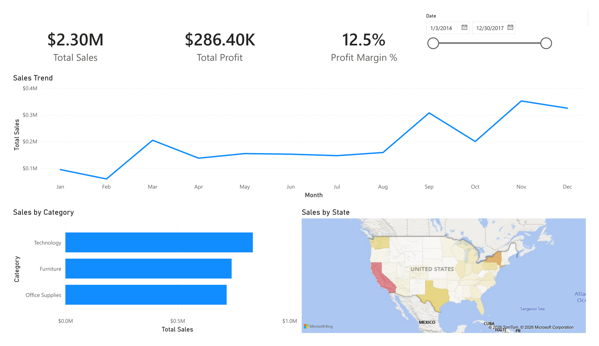
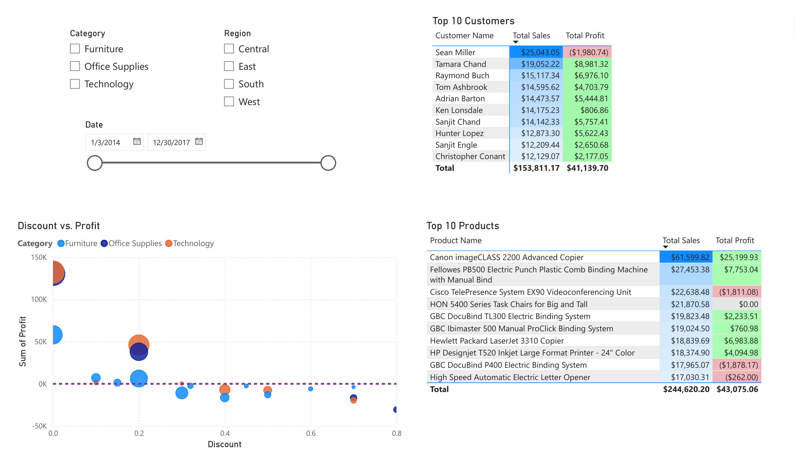

# Suoperstore Sales Dashboard
A two-page Power BI dashboard analyzing sales, profit, and discount trends for a fictional retail superstore, built on top of an Excel-based data cleaning and validation workflow.

## Here is the Dashboard Report Export:
**Overview**

**Sales Deep Dive**

## Project overview
 
This project explores ~9,800 orders from the [Superstore Sales Dataset](https://www.kaggle.com/datasets/vivek468/superstore-dataset-final) (Kaggle), covering 2014–2017. The goal was to clean and validate the raw data in Excel, then build an interactive Power BI dashboard answering a few core business questions:
- Which regions and categories drive the most sales and profit?
- How does seasonality affect monthly sales?
- What's the relationship between discounting and profitability?
- Are the best-selling products actually the most profitable ones?

## Tools used
 
- **Excel** — data cleaning, type formatting, pivot table validation
- **Power BI** — data modeling, DAX measures, interactive dashboard

## Process
 
1. **Data cleaning (Excel)**
   - Converted raw data to a Table, set correct column types (Postal Code as Text to preserve leading zeros, Discount/Profit Margin as Percentage, etc.)
   - Added a calculated Profit Margin column
   - Validated totals with pivot tables (sales/profit by region, sales by month) before modeling
2. **Data modeling (Power BI)**
   - Built a dedicated Date dimension table, marked as the official date table
   - Created a one-to-many relationship between Date and the Orders fact table
   - Fixed month-name sort order using a Sort by Column on `MonthNum`
   - Wrote DAX measures: Total Sales, Total Profit, Profit Margin %, YoY Sales Growth, Running Total
3. **Dashboard design**
   - Page 1 (Overview): KPI cards, sales trend, sales by category, sales by region (filled map)
   - Page 2 (Deep Dive): Discount vs. Profit scatter plot, Top 10 Customers, Top 10 Products, with Category/Region slicers

## Key insights
 
- **Central region underperforms on margin.** Despite solid sales volume, Central has a noticeably lower profit margin (~8%) than East, South, and West (12–15%), pointing to either heavier discounting or a less profitable product mix in that region.
- **Profit declines as discounts increase.** Profit turns negative for orders with higher discounts, visible in the cluster of points below the break-even line as discount increases past roughly 20–30%
- **Best-sellers aren't always profitable.** Several products in the Top 10 by sales, including the Cisco TelePresence System and the GBC DocuBind P400, actually post negative profit despite high revenue. Sales volume alone is a misleading success metric without checking margin.
- **Clear holiday seasonality.** Sales consistently peak in Q4, particularly November, across all four years in the dataset.

## Files in this repo
 
| File | Description |
|---|---|
| `Superstore_Sales_Analysis_PowerBI.pbix` | Power BI dashboard file |
| `Sample - Superstore.xlsx` | Cleaned dataset with pivot table validation |
| `Screenshots/` | Dashboard page exports |
 
## Possible next steps
 
- Add a forecast visual projecting next-period sales using the dataset's 4-year history
- Break out shipping cost/delay as an additional profitability factor
- Build a Region lookup table with enriched attributes (e.g., regional manager, sales targets) to demonstrate dimension-table modeling beyond a single column
